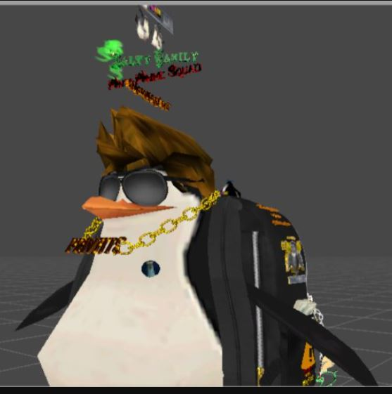

# 🧑‍🎨 Avatar 3D Personalizado — Blender + Unity (DEMO)

**Resumen:**  
Modelado, rigging, animación y efectos de partículas de un **avatar 3D personalizado** usando Blender y Unity.  
Exportado y optimizado para integración en plataformas interactivas.

**Tecnologías:** Blender · Unity · Shaders · Partículas VFX

---

## 🎥 Demo (gif / video)

---

## ✨ Características clave
- Modelado 3D de personaje con detalles estilizados.  
- Animación de huesos y blendshapes para expresiones.  
- Integración de partículas y shaders personalizados en Unity.  
- Exportación lista para VRChat / motores de juego.  

---

## 📂 Estructura del repo
- `assets/` → GIFs, imágenes y capturas de demostración.  
  

---

## 🔒 Código
El proyecto completo (archivos de Blender, Unity y scripts) está en un **repositorio privado** por motivos de propiedad intelectual.  

**Acceso al código:** disponible bajo solicitud (puedo invitarte a ver el repo privado).  

---

## 📬 Contacto 
gabrielce992@gmail.com

